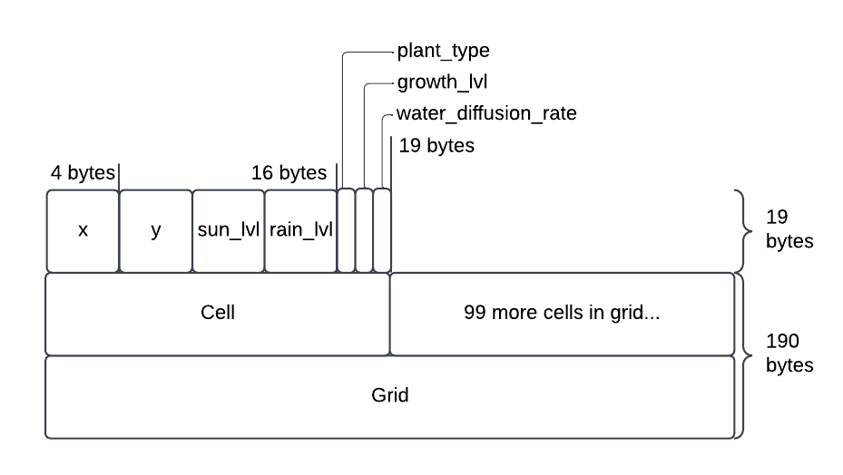

# 121-Final-project Devlog Entry - [11/14/2024]

## Introducing the team
Tools Lead: Elliot Ahlstroem  
Engine Lead: Raven Cruz  
Design Lead: Liza Gitelman & Jackie Sanchez  

## Tools and materials
The team will be developing a webgame using JavaScript.  This engine used will be the Phaser3 Engine.  We are choosing this engine because we are most comfortable with the libraries and capabilities of Phaser3.  Javasript is utilized in Phaser3, thus why we are using it.  

The team will be utilizing VSCode for all code writing.  Visual assets are made with Asesprite and/or will get assets from public domains.  We will be using Tiled for level design.  We chose these due to our familiarity of the tools and compatibility with Phaser3.
Public Domain Credits: TBD

Alternatively, our second platform of choice is Godot.  This will change the language used to C#.  Assets can still be made with the previously stated tools for this platform as well.

## Outlook
What is your team hoping to accomplish that other teams might not attempt?
Our team is hoping to be able to create a game that is more easily deployed and accessible to us as the developers.  This will also allow for quicker playtesting because of the quick turn around for deployment.  

What do you anticipate being the hardest or riskiest part of the project?
The riskiest part of the project is potentially having to switch to a different platform that none of us have too much experience with.

What are you hoping to learn by approaching the project with the tools and materials you selected above?
The team is hoping to expand their limited knowledge of Phaser3 and also learn to make cleaner code while working with a team.

# F0 Devlog - [11/22/2024]
## How we satisfied the software requirements
### FOa. Control a character moving in a 2D grid
The player is controlled through arrow keys.  The player moved to each tile with one press of any of the arrow keys by that direction.

### F0b. You advance time manually in the turn- based simulation
The time is advanced for the player by ending the day.  There is a text button towards the top of the screen that can be clicked and advances the day forward.  This will trigger other processes to happen for the day.

### F0c. You can reap or sow plants on a grid cells only when you are near them
The player reaps or sows plants within a 1 tile radius.  The player can click on a tile and the tile will be sown depending on if the tile has specific requirements met.

### F0d. Grid cells have sun and water levels
The grid cells have sun and water levels that are determined by a random seed.  Thes values are placed into a double array that will update the sun levels to the new values, while adding to the water values from the previous day.  

### F0e. Each plant on the grid has a distinct type and growth level
There are 3 types of plants currently in the game.  They are currently placeholders for the player to interact with.  The growth rate are dependant on how much water is in a tile and how much sun they accumulate. 

### F0f. Simple spatial rules govern plant growth based on sun, water, and nearby plants
For now, plants will be able to be planted when water has achieved a certain level.

### F0g. A play scenario is completed when some condition is satified
Once the player accumulates 10 of each plant, they "win" and the play scene starts over.

## Reflection
The team's plan changed a little bit for the inital programming language.  Initially we wanted to code in typescript due to our phamiliarity with Phaser.  Later we realized we had been utilizing Javascript, and adjusted accordingly.  The team leads were all the same, and also when there may have been knowledge gaps, the team helped each other in general.  

In terms of quick run turn around, we are a little behind on our goals to make code faster, but are on the right track.  The team is working together and is also encouraging the use of partner coding and reaching out whenever there is help needed.

The group may change their chosen end engine, given the amount of time allotted and see if there is an option in Typescript versus having to learn a gaming engine with a new language, given the initial experience with familiar objects.

# F1 Devlog - [11/27/24]

## How we satisfied the software requirements

### FOa. Control a character moving in a 2D grid
Same.

### F0b. You advance time manually in the turn- based simulation
Same.

### F0c. You can reap or sow plants on a grid cells only when you are near them
Same.

### F0d. Grid cells have sun and water levels
Same.

### F0e. Each plant on the grid has a distinct type and growth level
Same.

### F0f. Simple spatial rules govern plant growth based on sun, water, and nearby plants
Same.

### F0g. A play scenario is completed when some condition is satified
Same.

### F1.a The important state of your game's grid must be backed by a single contiguous byte array in AoS or SoA format. If your game stores the grid state in multiple format, the byte array format must be the primary format (i.e. other formats are decoded from it as needed).  
Our game's grid state, which stores the state of the weather per cell in the grid as well as the plant information per cell, is stored in a single byte array in AoS format. We had already constructed the game state to be stored in a 2d array grid, so the AoS format was intuitive to restructure our game to fit. Each index of the grid is an array, and each index of that array is an array of cells that store information about the cell's state in the game. Below is a diagram of the storage.

### F1.b The player must be able to manually save their progress in the game. This must allow them to load state and continue play another day (i.e. after quitting the game app). The player must be able to manage multiple save files/slots.  
The interface has a 'save' button that, when clicked, save the player's progress by storing the grid state, the player state, and the undo/redo stack in JSON format to the browser's local storage. When the player clicks the 'load' button, the game parses the stored data from local storage and applies the grid state, player state, and undo/redo stack to the grid. 

### F1.c The game must implement an implicit auto-save system to support recovery from unexpected quits. (For example, when the game is launched, if an auto-save entry is present, the game might ask the player "do you want to continue where you left off?" The auto-save entry might or might not be visible among the list of manual save entries available for the player to load as part of F1.b.)  
Since our game's time runs on a day-by-day system, and no significant changes happen between days, we added an autosave at the end of each day that the player can return to. When the player opens the game, they have the option to open a new game or load a previous save through a screen that shows them each save, and the save they choose can be an autosave. 

### F1.d The player must be able to undo every major choice (all the way back to the start of play), even from a saved game. They should be able to redo (undo of undo operations) multiple times.  
Each change to the grid state, the player state, the plants, and the weather is stored in an array that behaves as a stack. When players click the undo button, the game pops the last action on the stack, and puts it into a redo array, which also behaves as a stack, and refreshes the grid, and vice versa when the player presses the redo button. 

## Reflection
The team went into this section of the project intending to have far more opportunities for intentional partner coding, but unfortunately, the reality of everyone's schedules made it difficult for us to have overlapping time to work together. Programming ended up being done in chunks by different people, and we all ended up dipping our toes into different tasks as we worked to make the game cohesive, but this also helped us all learn more about how our code functions on a deeper level.

We ended up drastically changing the grid implementation to work as a byte array, but worked to keep complex functions easily accessible and with recognizable names. The Plant class was rendered useless, as well as some other functions, so we'll have to do some significant code cleanup before going forward with new features. We definitely had trouble converting some of our old functions to work with a new grid framework, so we should consider abstracting more of our features and functions to make this switch easier next time we're asked to change the code.

The nature of JavaScript's abstraction from memory made it more difficult to implement the byte array storage and the save states for the game, so this was a struggle for our group, but we worked around it well enough for this time around. However, a language like C++ or C#, perhaps in Godot, would be more helpful for this kind of storage implementation. However, we researched and found ways to solve these problems with Phaser and JS functions. In the future, switching to an object-oriented language with memory management support like C++/C# would ultimately be helpful to our framework for the project. 

# F2 Devlog - [12/3/24]

## How we satisfied the software requirements

### FOa. Control a character moving in a 2D grid
Same.

### F0b. You advance time manually in the turn- based simulation
Same.

### F0c. You can reap or sow plants on a grid cells only when you are near them
Same.

### F0d. Grid cells have sun and water levels
Same.

### F0e. Each plant on the grid has a distinct type and growth level
Same.

### F0f. Simple spatial rules govern plant growth based on sun, water, and nearby plants
Same.

### F0g. A play scenario is completed when some condition is satified
Same.

### F1.a The important state of your game's grid must be backed by a single contiguous byte array in AoS or SoA format. If your game stores the grid state in multiple format, the byte array format must be the primary format (i.e. other formats are decoded from it as needed).  
Same.

### F1.b The player must be able to manually save their progress in the game. This must allow them to load state and continue play another day (i.e. after quitting the game app). The player must be able to manage multiple save files/slots.  
Same.

### F1.c The game must implement an implicit auto-save system to support recovery from unexpected quits. (For example, when the game is launched, if an auto-save entry is present, the game might ask the player "do you want to continue where you left off?" The auto-save entry might or might not be visible among the list of manual save entries available for the player to load as part of F1.b.)  
Same.

### F1.d The player must be able to undo every major choice (all the way back to the start of play), even from a saved game. They should be able to redo (undo of undo operations) multiple times.  
Same.

### F2.a External DSL for scenario designs: In separate text file or text block, designers should be able to express the design of different gameplay scenarios, e.g. starting conditions, weather randomization policy, and victory conditions. The language must be able to schedule unique events that happen at specific times.
Our team restructured the code to use a YAML configuration file, called `world.yaml`, to carry the configuration details for our Phaser game. We created a `globals` item in the Phaser Game configuration to store the parsed world data from the YAML configuration file, parsed using yaml's built-in `load` function.

### F2.b Internal DSL for plant types and growth conditions: Within the main programming language used for the rest of your game, you should implement and use a domain-specific language for defining your different types of plants and the unique growth rules that apply to each. (Think about how you could add and remove item types from your D1 code by pushing/popping items from an array or how you could create new types of stickers at runtime in D2.)
Our team restructured the plant types, growth levels, and growth conditions for the plants into an internal DSL as a YAML configuration file, named `plants.yaml`. We created a `globals` item in the Phaser Game configuration to store the parsed plant data from the YAML configuration file, parsed using yaml's built-in `load` function.

### F2.c Switch to an alternate platform: Change either your project's primary programming language or your primary user interface library/engine/framework. As more of your design is expressed in DSLs, your design becomes increasingly insulated from changes to your primarily programming language or engine. Using your earlier implementation as a reference, it becomes more realistic that you'd be able to leverage generative AI for the large but mostly mindless translations from one language or engine to another.
Originally, our code was in JavaScript and we inteded our backup platform to be Godot, since we each had some experience with C++. However, since we conquered the hurdle of implementing controlled memory storage in JavaScript, we decided to make a smaller jump and transitioned our code to be in TypeScript instead, due to its similar structure to JavaScript. Since TypeScript is strongly typed, we had to go through our code and add correct types to each file, function, and class. This was manually done by one of our team members, Liza, with extra sets of eyes to find smaller bugs later on. 

## Reflection
As we implemented the F2 requirements, we reconsidered our previous choice for Godot as our backup platform, since we had already gone so far with implementing this game using JavaScript, and TypeScript would still be compatible with our libraries and frameworks, with only a few minor changes. If we had been asked to switch platforms in the same step as restructuring the memory storage, we may still have chosen Godot in order to be able to work with memory directly in C++, but since we had already completed that in JavaScript, it felt unnecessary to make such a large leap this late in the game development process.

As for the DSLs, we gravitated towards YAML for both our internal and external DSLs because our configuration requirements could be easily implemented in a YAML file, and parsed as an object to read through in our game program. We did not feel the need to write our own DSL for external use due to the simple nature of our game's win conditions, world requirements, etc.  

## Resources
In creating the tilemap & tileset, we used the [Tiled software](https://www.mapeditor.org/) and Kenney's [Tiny Town tileset](https://kenney.nl/assets/tiny-town) as well as the [Pixel Platformer Farm Expansion](https://kenney.nl/assets/pixel-platformer-farm-expansion) for the plant sprites. The player was created from the [Hana Caraka Base Character tileset](https://bagong-games.itch.io/hana-caraka-base-character) with spritesheet support via [TexturePacker](https://www.codeandweb.com/texturepacker).

Perlin noise library used for weather generation is [noisejs by Seph Hentle](https://github.com/josephg/noisejs).